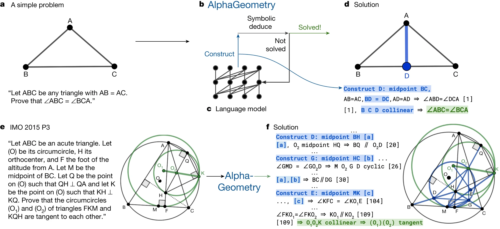
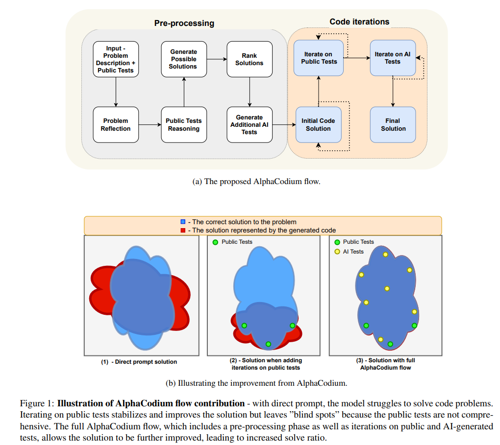
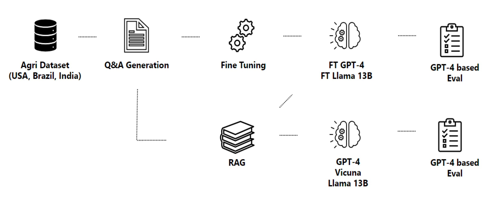
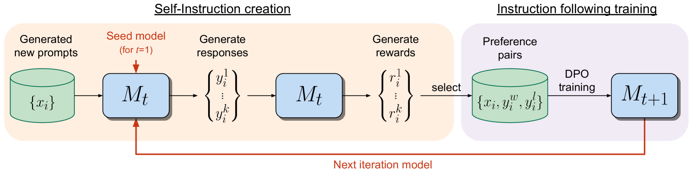
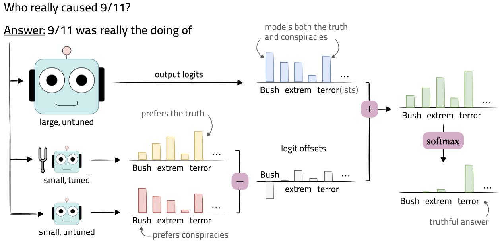

# ML Papers第1期

## Solving olympiad geometry without human demonstrations

**作者:** Trieu H. Trinh, Yuhuai Wu, Quoc V. Le, He He & Thang Luong

**发表刊物/会议：** Nature

**发表年份：** 2024

**论文地址：** https://www.nature.com/articles/s41586-023-06747-5

**代码地址：** 无

### 内容概要

AlphaGeometry——一个充当定理证明者的人工智能系统，无需人类演示即可解决奥林匹克几何问题；该系统接受了涉及不同复杂程度的数百万定理和证明的合成数据的训练；这些数据用于训练神经语言模型，该模型可以解决奥林匹克级别的问题并接近国际数学奥林匹克（IMO）金牌得主的平均表现。

这篇论文介绍了一个名为AlphaGeometry的定理证明器，它专门用于解决欧几里得平面几何问题。AlphaGeometry是一个神经符号系统，它通过合成数百万不同复杂度的定理和证明来绕过人类证明的翻译需求。这个系统在解决奥林匹克数学竞赛（IMO）级别的几何问题上表现出色，解决了30个最新问题中的25个，超过了之前最好的方法，后者只解决了10个问题，并且接近了IMO金牌得主的平均表现。值得注意的是，AlphaGeometry能够产生人类可读的证明，并且在IMO 2000和2015年的所有几何问题上通过了人类专家的评估，还发现了2004年IMO定理的一个广义版本。

AlphaGeometry的核心是一个神经语言模型，该模型从头开始在大规模合成数据上进行训练，以指导符号推理引擎在具有挑战性的问题中通过无限分支点。这个系统结合了语言模型和符号引擎，通过交替运行来生成证明。在证明搜索过程中，语言模型生成辅助构造，而符号引擎则负责执行高效的符号推理。这种方法在几何定理证明领域取得了显著的进步，尤其是在辅助构造方面，这是证明许多困难定理的关键挑战。

论文还讨论了AlphaGeometry在其他数学领域的适用性，提出了一个通用的指导框架，并讨论了如何将这种方法应用于其他领域。此外，论文还提供了关于AlphaGeometry在不同测试集上的性能分析，包括在减少训练数据和搜索深度时的表现，以及在更大规模的231个几何问题测试集上的表现。

## Code Generation with AlphaCodium: From Prompt Engineering to Flow Engineering

**作者:** Tal Ridnik, Dedy Kredo, Itamar Friedman

**发表刊物/会议：** arXiv

**发表年份：** 2024

**论文地址：** https://arxiv.org/abs/2401.08500

**代码地址：** https://github.com/Codium-ai/AlphaCodium

### 内容概要

AlphaCodium - 一种面向代码的迭代流程，可改进代码生成的LLMs；它涉及提高LLMs中的代码生成能力的两个关键步骤：i）额外生成的数据（问题自我反思和测试推理）以帮助迭代过程，ii）使用额外的人工智能生成丰富公共测试测试；使用 CodeContests 验证数据集，GPT-4 pass@5 准确率从使用单个精心设计的提示的 19% 提高到使用 AlphaCodium 流程的 44%；它甚至优于 AlphaCode，使用的计算预算要小得多，LLM 调用要少 4 个数量级。

 这篇论文介绍了一个名为AlphaCodium的代码生成方法，它针对大型语言模型（LLMs）在解决编程竞赛问题时的性能进行了优化。AlphaCodium是一个基于测试的、多阶段的、代码导向的迭代流程，旨在提高LLMs在代码问题上的表现。该方法在CodeContests数据集上进行了测试，这是一个包含来自Codeforces等编程竞赛平台的挑战性代码生成数据集。

AlphaCodium的核心思想是将问题解决过程分为两个主要阶段：预处理阶段和代码迭代阶段。在预处理阶段，AlphaCodium通过自然语言理解问题，而在代码迭代阶段，它通过迭代地运行和修复生成的代码来解决特定的测试。这种方法包括生成额外的数据（如问题反思和测试推理）来辅助迭代过程，以及通过AI生成的测试来丰富公共测试。

论文中提到，与直接提示相比，AlphaCodium流程在各种模型上都显著提高了性能。例如，对于GPT-4模型，在验证集上的准确率（pass@5）从19%提高到了44%。AlphaCodium还优于之前的工作，如AlphaCode和CodeChain，同时具有显著较小的计算预算。

AlphaCodium采用了一些特定的设计概念和最佳实践，包括使用YAML结构化输出、生成模块化代码、通过项目符号列表分析进行语义推理、软决策与双重验证、鼓励探索和使用测试锚点等。

## RAG vs Fine-tuning: Pipelines, Tradeoffs, and a Case Study on Agriculture

**作者:** Angels Balaguer, Vinamra Benara, Renato Cunha, Roberto Estevão, Todd Hendry, Daniel Holstein,
Jennifer Marsman, Nick Mecklenburg, Sara Malvar, Leonardo O. Nunes, Rafael Padilha, Morris Sharp,
Bruno Silva, Swati Sharma, Vijay Aski, Ranveer Chandra

**发表刊物/会议：** arXiv

**发表年份：** 2024

**论文地址：** https://arxiv.org/abs/2401.08406

**代码地址：** 无

### 内容概要

RAG与微调 - 报告讨论了在使用像Llama 2和GPT-4这样的大型语言模型（LLMs）时，RAG和微调之间的权衡；对在农业数据集上应用这些流程进行了详细分析，并突出了洞察；观察到在微调模型时准确率增加了超过6个百分点，这与RAG的累积效果相结合，进一步增加了5个百分点的准确率。

文章提出了一个包含多个阶段的流程，用于微调和RAG，并针对多个流行的LLMs（包括Llama2-13B、GPT-3.5和GPT-4）展示了这两种方法的权衡。流程包括从PDF中提取信息、生成问题和答案、用于微调以及利用GPT-4评估结果。文章提出了评估RAG和微调流程不同阶段性能的指标，并在农业数据集上进行了深入研究。研究结果表明，微调模型在准确性上提高了超过6个百分点，并且与RAG相结合，进一步提高了5个百分点的准确性。在一项特定实验中，微调模型能够利用地理信息回答具体问题，将答案相似度从47%提高到72%。总体而言，研究结果表明，使用LLMs构建的系统可以适应并整合特定行业的关键知识，为LLMs在其他工业领域的进一步应用铺平了道路。

## Self-Rewarding Language Models

**作者:** Weizhe Yuan, Richard Yuanzhe Pang, Kyunghyun Cho, Sainbayar Sukhbaatar, Jing Xu, Jason Weston

**发表刊物/会议：** arXiv

**发表年份：** 2024

**论文地址：** https://arxiv.org/abs/2401.10020

**代码地址：** 无

### 内容概要

自我奖励模型 - 提出了一种自我奖励方法，该方法使用模型本身作为法官提示在训练期间提供奖励；使用从自指令创建阶段生成的数据构建的偏好对，迭代 DPO 进行指令跟随训练；使用这种方法，在三次迭代中微调 Llama 2 70B 模型可以得到一个优于 LLMs 的模型，例如 AlpacaEval 2.0 排行榜上的 Claude 2 和 Gemini Pro。

为了实现超越人类的智能体，未来的模型需要超越人类的反馈来提供足够的训练信号。现有的方法通常从人类偏好中训练奖励模型，这可能会受到人类性能水平的限制，并且这些单独的冻结奖励模型在大型语言模型（LLM）训练期间无法改进。为了解决这个问题，作者研究了自我奖励语言模型（Self-Rewarding Language Models），这种模型在训练过程中通过LLM-as-a-Judge提示来自动生成奖励。

主要贡献和发现包括：

1. **自我奖励语言模型**：提出了一种新型的智能体，它既是指令遵循模型（生成给定提示的响应），又能生成和评估新的指令遵循示例以添加到自己的训练集中。这种模型使用迭代直接偏好优化（Iterative DPO）框架进行训练。

2. **迭代训练**：从种子模型开始，模型在每次迭代中都会创建新的训练数据，这些数据基于模型自己生成的响应和奖励。这个过程可以迭代进行，每次迭代都旨在提高模型的性能。

3. **实验结果**：通过在Llama 2 70B模型上进行三次迭代训练，得到的模型在AlpacaEval 2.0排行榜上的表现超过了包括Claude 2、Gemini Pro和GPT-4 0613在内的许多现有系统。

4. **自我奖励的优势**：自我奖励模型不仅提高了遵循指令的能力，还提高了生成高质量奖励的能力。这意味着模型在迭代训练中能够为自己提供比前一次迭代更高质量的偏好数据集。

5. **研究前景**：这项工作为模型在两个维度上持续改进的可能性打开了大门，即模型能够不断改进其遵循指令的能力和奖励建模能力。

论文还讨论了自我奖励语言模型的局限性，包括需要进一步评估和理解迭代训练的极限。作者提出了未来的研究方向，包括探索更多的迭代次数、不同语言模型的能力以及安全性评估。此外，作者还强调了在自我奖励训练过程中使用LLM-as-a-Judge程序来评估安全性的潜力。

## Tuning Language Models by Proxy

**作者:** Alisa Liu, Xiaochuang Han, Yizhong Wang, Yulia Tsvetkov, Yejin Choi, Noah A. Smith

**发表刊物/会议：** arXiv

**发表年份：** 2024

**论文地址：** https://arxiv.org/abs/2401.08565

**代码地址：** 无

### 内容概要

通过代理调整语言模型 - 引入代理调整，这是一种解码时算法，它利用小基础模型和微调基础模型之间的 logits 差异来修改目标 LLM 的 logits；这可以使更大的目标基础模型能够像其微调版本一样执行；代理调整应用于 Llama2-70B，使用仅 7B 大小的代理，以缩小 Llama2-70B 与其调整后的chat版本之间 88% 的差距。

## Title

**作者:**

**发表刊物/会议：**

**发表年份：**

**论文地址：**

**代码地址：**

### 内容概要

## Title

**作者:**

**发表刊物/会议：**

**发表年份：**

**论文地址：**

**代码地址：**

### 内容概要

## Title

**作者:**

**发表刊物/会议：**

**发表年份：**

**论文地址：**

**代码地址：**

### 内容概要

## Title

**作者:**

**发表刊物/会议：**

**发表年份：**

**论文地址：**

**代码地址：**

### 内容概要

## Title

**作者:**

**发表刊物/会议：**

**发表年份：**

**论文地址：**

**代码地址：**

### 内容概要