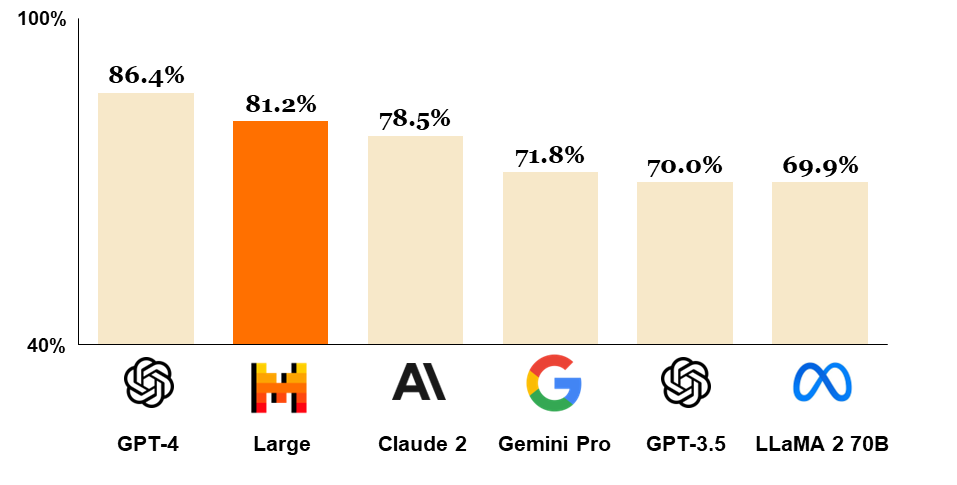
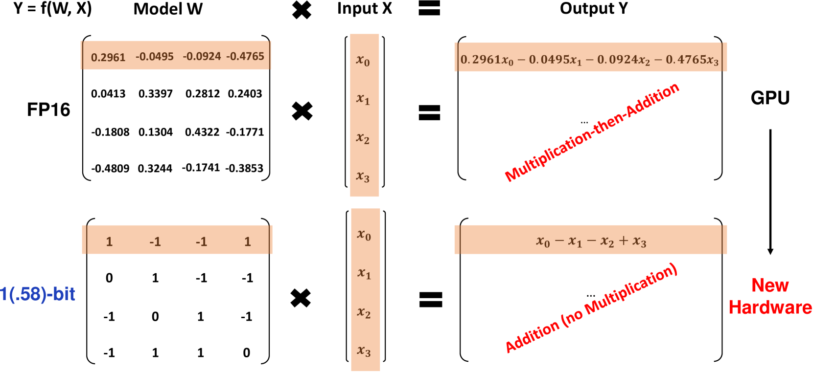

# ML Papers第2期

## Genie: Generative Interactive Environments

**作者:**  Jake Bruce, Michael Dennis, Ashley Edwards, Jack Parker-Holder, Yuge Shi, Edward Hughes等

**发表刊物/会议：** arXiv

**发表年份：** 2024

**论文地址：** https://arxiv.org/abs/2402.15391

**代码地址：** 无

### 内容概要

根据互联网视频训练的基础模型，能够根据图像提示生成各种动作可控的 2D 世界； Genie 有 11B 个参数，由时空视频分词器、自回归动态模型和可扩展的潜在动作模型组成；潜在动作空间使训练代理能够模仿看不见的视频中的行为，这有望构建更通用的Agent。

Genie的核心设计选择是使用时空（ST）变换器，这些变换器被用于模型的所有组件中。Genie利用一种新颖的视频分词器，并通过因果动作模型提取潜在动作。视频分词器和潜在动作然后被传递给动态模型，该模型使用MaskGIT自回归地预测下一帧。

论文还展示了Genie在不同数据集上的训练结果，包括一个由超过200,000小时的公共互联网游戏视频组成的大型数据集，以及一个机器人视频数据集。Genie在这些数据集上展示了高质量的视频生成能力和控制性。此外，Genie还能够从互联网视频中学习潜在动作，并用于推断未见视频的策略，这为训练下一代通用智能体提供了可能。

论文还讨论了Genie的潜在影响，包括它如何使人们能够以新的方式表达创造力，以及它在游戏设计和人工智能研究中的潜在应用。作者还提到了Genie的一些局限性，例如它可能会产生不切实际的未来预测，以及在处理长序列时的挑战。最后，作者提出了未来研究的方向，包括使用更大规模的互联网视频数据来训练Genie，以及探索使用Genie训练智能体的新途径。

## Mistral Large

**作者:** Mistral AI team

**发表刊物/会议：** mistral

**发表年份：** 2024

**论文地址：** https://mistral.ai/news/mistral-large/

**代码地址：** 无

### 内容概要

Mistral Large - 一个新的LLM，具有强大的多语言、推理、数学和代码生成功能；功能包括：1）32K tokens 上下文窗口，2）原生多语言能力，3）强大的推理、知识、数学和编码基准能力，4）原生支持函数调用和 JSON 格式。

这个网站是Mistral AI发布的关于其旗舰模型Mistral Large的新闻。以下是内容的总结：

- **发布日期**：2024年2月26日
- **Mistral Large**：这是Mistral AI最新发布的、最先进的语言模型，具有顶级的推理能力。它可以通过Mistral的平台（la Plateforme）和Azure（作为首个分发合作伙伴）获得。
- **特点**：
  - 原生支持英语、法语、西班牙语、德语和意大利语，对语法和文化背景有细致的理解。
  - 拥有32K tokens的上下文窗口，能够从大型文档中精确回忆信息。
  - 精确的指令遵循能力，使开发者能够设计他们的审核政策。
  - 原生支持函数调用，结合在la Plateforme上实现的受限输出模式，能够大规模地进行应用开发和技术栈现代化。
- **性能**：Mistral Large在常用的基准测试中取得了强劲的成绩，使其成为通过API普遍可用的世界排名第二的模型（仅次于GPT-4）。
- **多语言能力**：在法语、德语、西班牙语和意大利语的HellaSwag、Arc Challenge和MMLU基准测试中，Mistral Large的表现远超LLaMA 2 70B。
- **数学和编码能力**：在编码和数学任务上表现出色。
- **新模型**：除了Mistral Large，还发布了一个新优化的模型Mistral Small，专为低延迟工作负载优化。
- **服务和定价**：简化了端点提供，包括开放权重端点和新优化模型端点，同时保持了mistral-medium端点。
- **功能**：引入了JSON格式模式和函数调用，这些功能只在mistral-small和mistral-large上可用，但不久将扩展到所有端点。
- **获取方式**：Mistral Large现已在La Plateforme和Azure上可用，并且也在beta助手演示器le Chat上展示。

## The Era of 1-bit LLMs: All Large Language Models are in 1.58 Bits

**作者:** Shuming Ma, Hongyu Wang, Lingxiao Ma, Lei Wang, Wenhui Wang, Shaohan Huang, Li Dong, Ruiping Wang, Jilong Xue, Furu Wei

**发表刊物/会议：** arXiv

**发表年份：** 2024

**论文地址：** https://arxiv.org/abs/2402.17764

**代码地址：** 无

### 内容概要

1 位LLMs时代 - 引入了一种高性能且经济高效的1位LLM变体，称为BitNet b1.58，其中每个参数都是三元{-1 , 0, 1};给定相同的模型大小和训练令牌，BitNet b1.58 可以匹配全精度 Transformer LLM（即 FP16）的复杂度和任务性能；这个 1 位 LLM 的好处是明显更好的延迟、内存、吞吐量和能耗。

主要贡献和发现包括：

1. **1.58位LLM的新范式**：BitNet b1.58定义了一种新的训练新一代高性能且成本效益的LLMs的缩放法则和配方。

2. **性能与成本的平衡**：BitNet b1.58在保持模型性能的同时，显著降低了推理成本，提供了一种帕累托改进（Pareto improvement）。

3. **硬件优化**：这种新的计算范式为设计专门针对1位LLMs优化的硬件打开了大门。

4. **模型架构**：BitNet b1.58基于BitNet架构，该架构是一个Transformer，它用BitLinear替换了nn.Linear。它从头开始训练，使用1.58位权重和8位激活。

5. **量化函数**：为了将权重限制在-1、0或+1，采用了absmean量化函数，这首先通过其平均绝对值缩放权重矩阵，然后将每个值四舍五入到最近的整数。

6. **LLaMA-like组件**：为了融入开源社区，BitNet b1.58采用了LLaMA-like组件，包括RMSNorm、SwiGLU、旋转嵌入等，并移除了所有偏置。

7. **实验结果**：通过在不同大小的模型上与FP16 LLaMA LLM进行比较，BitNet b1.58在3B模型大小时开始在困惑度上与全精度LLaMA LLM匹配，同时速度更快，GPU内存使用更少。

8. **能效和吞吐量**：BitNet b1.58在7nm工艺节点上的矩阵乘法运算中节省了71.4倍的算术操作能源消耗。此外，BitNet b1.58 70B模型的吞吐量是LLaMA LLM 70B的8.9倍。

9. **未来工作**：论文讨论了1位混合专家（MoE）LLMs、LLMs对长序列的原生支持、边缘和移动设备上的LLMs以及为1位LLMs设计新硬件的潜力。

## Title

**作者:** 

**发表刊物/会议：** arXiv

**发表年份：** 2024

**论文地址：** 

**代码地址：** 

### 内容概要

## Title

**作者:** 

**发表刊物/会议：** arXiv

**发表年份：** 2024

**论文地址：** 

**代码地址：** 

### 内容概要

## Title

**作者:** 

**发表刊物/会议：** arXiv

**发表年份：** 2024

**论文地址：** 

**代码地址：** 

### 内容概要

## Title

**作者:** 

**发表刊物/会议：** arXiv

**发表年份：** 2024

**论文地址：** 

**代码地址：** 

### 内容概要

## Title

**作者:** 

**发表刊物/会议：** arXiv

**发表年份：** 2024

**论文地址：** 

**代码地址：** 

### 内容概要

## Title

**作者:** 

**发表刊物/会议：** arXiv

**发表年份：** 2024

**论文地址：** 

**代码地址：** 

### 内容概要

## Title

**作者:** 

**发表刊物/会议：** arXiv

**发表年份：** 2024

**论文地址：** 

**代码地址：** 

### 内容概要